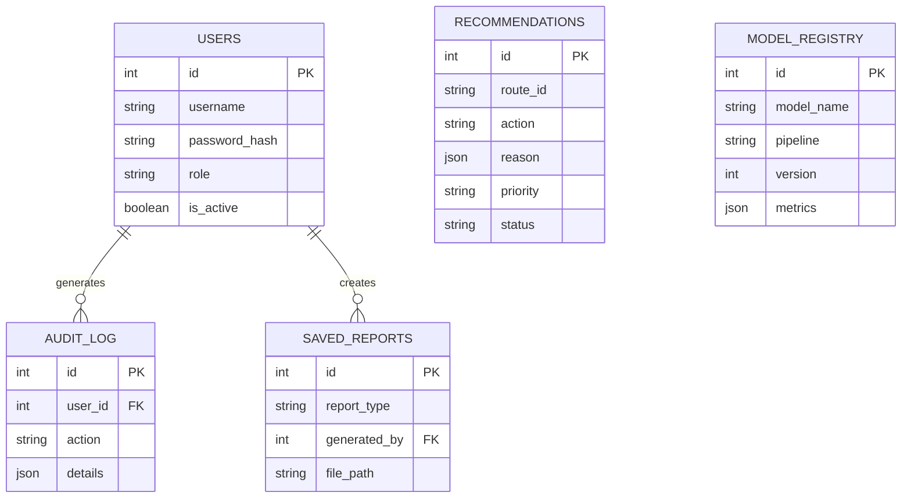

# Database Design

## Overview
The application database (relational) holds operational and metadata objects like Users, Audit Logs, and saved Recommendations.
**It does NOT hold the Big Data (trips, tickets) which remain in Parquet format.**

## ER Diagram

## Security
- Passwords hashed with `bcrypt`.
- JWT Tokens signed with `HS256` secret logic.
- Audit table is append-only.

## Backup Approach (Production)
In a real deployment (e.g. Render/Railway), PostgreSQL automated daily backups should be enabled via `pg_dump`, retaining 7-14 days of snapshots.
